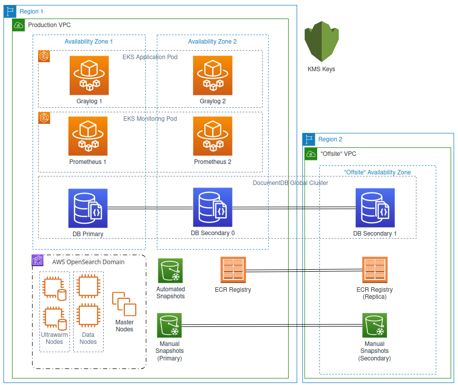
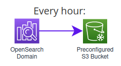
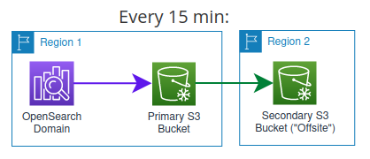
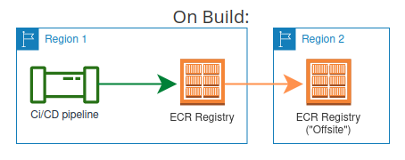

# Cloud Backup and Recovery Policy
This policy is designed to protect data within Graylog Cloud to be sure it is not lost and can be recovered in the event of an equipment failure, intentional destruction of data, or disaster.  It encompasses the Retention Cycle for Customers, detailing [Log Retention](#log-retention), [Alerting](#alerting), [Encryption](#encryption), [Replication](#replication) Across Sites, and [Procedures](#procedures). General requirements for each of these components will be outlined and specifics related to our platform implementation (a.k.a. ["Platform Component Specifics"](#platform-component-specifics)) will be provided below.

## Scope
This policy applies to all data which provides the service delivered (“Graylog Cloud”) that is owned/leased and operated by Graylog, Inc. 
#### Not Covered
This policy does not cover Bastion (jumpbox) instances, development tools, or other components of the design and troubleshooting processes.

## General Requirements
These requirements are to be used by default. They can be overridden by the requirements
specific to a given component (see [Platform Component Specifics](#platform-component-specifics) below).

### Log Retention
* We must fully guarantee backups and restoration of backups for the full period of time that a customer retains data with us.
	* For example, if a customer bought 90 days of log retention, we have to keep a backup of all those 90 days to be able to fully restore all data.
* To protect customer data against datacenter failure, backups will be distributed to at least one additional datacenter location. (See the "[Replication](#replication)" section below.)

### Alerting
* Time-series metrics gathering will be employed in order to maintain real-time observability of the cluster state. Examples of observable data include:
	* Data reads/writes
	* Duration and completion of automated and manual backups
	* 40X, 50X or other undesired responses from the search service
	* Other indications of state as surfaced by the application itself
 * Where appropriate, time-series metrics that pass an alerting threshold will trigger an entry in an Incident Response system, which will continue to escalate the alert until an incident is acknowledged. Incident acknowledgement and resolution will be covered in the [Procedures](#procedures) section below.
 * In addition to alerting on time-series metrics, alerting as surfaced by cloud provider may be employed for critical elements, such as the search service entering a fail state ("Red Cluster").
* Alert auditing and cleanup will be conducted annually as part of standard disaster recovery maintenance. This audit will focus on three areas:
	* Effectiveness, e.g. "Does this alert detect a state that requires intervention to resolve?"
	* Actionability, e.g. "If this alert triggers, does it provide a link to a runbook or similar clear route of action to follow?"
	* Sensitivity, e.g. "Will false positives from this alert contribute to signal fatigue?"

### Encryption
* In transit
	* Data transfer into or outside of the cloud platform will be encrypted using a secure transfer protocol.
	* For example, the TLS 1.2 protocol or later for HTTPS communication will be employed.
* At Rest
	* The following components will be encrypted-at-rest:
		* Application Components
			* Application server hard disk volumes
		* Log Components
			* All indexes (including backup and high-availability indexes)
			* Search service logs, including slow logs and error logs
			* Swap files
			* All other data in the application directory
			* Automated snapshots
			* Manual snapshots
		* Settings Database Components
			* Database instances
			* Automated Backups
			* Manual Snapshots
			* Indexes
	* At a minimum, 256-bit Advanced Encryption Standard (AES-256) will be used for all at-rest encryption.

### Replication
* Search Service
	* The search service shall maintain "warm" replica nodes within the same datacenter, and snapshots of the data within the search service shall be replicated to at least one additional datacenter. 
* Settings Database
	* A settings database cluster with a minimum of 3 instances (one "Primary", at least one "Secondary", and one "Offsite") will be utilized.
		* The "Primary" and "Secondary" instances will exist in separate Availability Zones within the same datacenter.
		* The "Offsite" instance shall be maintained in a separate datacenter, with its own automatic and manual backup schedule identical to that of the "Primary" settings database.
* Monitoring
	* A minimum of 2 monitoring instances will operate in separate Availability Zones.
* Application
	* A minimum of 2 application instances will operate in separate Availability Zones.
	* Docker containers, instance images, and any necessary configuration or other secondary components will be replicated to a separate datacenter every time such components are updated.

### Procedures
* Indicents
	* Alerted states (See "[Alerting](#alerting)" above) will trigger an entry in an Incident Repsonse system, and begin by alerting the team responsible for the component in the system generating the incident.
	* If this entry goes unacknnowledged in the system, it will continue to escalate to higher authority until it is acknowledged.
	* Once acknowledged, it is the responsibility of the acknowledging party to provide an initial communication to the appropriate communications channel.
	* Once communicated, it falls to that party either to follow the linked Runbook (see below) or delegate resolution to the appropriate party.
	* Once the condition for the alert is no longer met or it's determined that the state is a false positive, the incident can be closed.
		* In the event of a false positive, the appropriate communications channel may be notified, and the condition muted against further false positives if appropriate.
* Runbooks
	* Alerted states that trigger Incident Response (See above), unless resolution steps are simple enough to include within the alert itself, will link to a "Runbook" with explicit resolution steps and resources.
		* These "Runbooks" will be maintained in the same manner as other company documentation and are the collective responsibility of all developers to keep up to date.
		* As with other alerting components, auditing and cleanup will be conducted annually as part of standard disaster recovery maintenance.
* Disaster Recovery Drills
	* In order to confirm the ability to fail over and maintain operations through the loss of major components, quarterly Disaster Recovery drills ("DR") will take place. These will involve:
		* Backup restoration in a secondary datacenter
		* Spinup of application and monitoring components within that datacenter
		* Confirmation of restored functionality
	* A quarterly report of the results of these drills, along with the estimated downtime that would have occurred, will be reported to the Senior Leadership Team (SLT) as appropriate.
	* The owners of this policy (See "[Ownership](#ownership)" below) are responsible for scheduling and performing these drills, unless otherwise specified.
* Disaster Recovery Maintenance
	* The components of this policy, including the policy itself, appropriate resolution documentation, alerting components, and the Incident Response chain of command, will be revisited for correctness on an annual basis at a minimum.
	* The owners of this policy (See "[Ownership](#ownership)" below) are responsible for scheduling maintenance, unless otherwise specified.

# Platform Component Specifics
In its current implementation, the service architecture makes use of the following AWS-specific products:
* AWS OpenSearch 
	* This is the search service used for the architecture. This encompasses all references to "search service" in the [General Requirements](#general-requirements) section above.
* AWS S3
	* Manual backups for the OpenSearch Service. See the [Manual Snapshots](#manual-snapshots) section below.
* Elastic Kubernetes Service (EKS)
	* This is used for the Application and Monitoring compute resources.
* Fargate
	* EKS invokes on-demand Fargate instances to run its Kubernetes pods.
* Elastic Container Registry (ECR)
	* Docker containers deployed through EKS are hosted in AWS via the Elastic Container Registry (ECR). Docker images built via CI/CD are deployed to ECR as part of the build.
* DocumentDB
	* Application settings are contained within a MongoDB-compatible cluster and make use of the AWS DocumentDB product.
* KMS
	* Encryption-at-rest for the components listed below is managed by the AWS Key Management Service (AWS KMS):
		* This includes OpenSearch, S3, DocumentDB, and ECR.

## Architecture Diagram
_Note: This diagram represents the components and relationships required for this policy **only**. Please see the primary documentation for a more comprehensive diagram._

## AWS OpenSearch Service
Snapshots in Amazon OpenSearch Service are backups of a cluster's indexes and state. State includes cluster settings, node information, index settings, and shard allocation. OpenSearch snapshots are incremental, meaning they only store data that changed since the last successful snapshot. The AWS OpenSearch Service provides both automated and manual snapshots. We use both.

### Automated Snapshots

 * Automated snapshots are only for cluster recovery. They can be used to restore the
OpenSearch domain in the event of acquiring the red status or data loss. For more information, see Restoring snapshots.
 * The OpenSearch service stores automated snapshots in a preconfigured Amazon S3 bucket at no additional charge.
 * OpenSearch retains up to 336 of them for 14 days.
 * The objects in the preconfigured S3 bucket cannot be accessed directly.
 * NOTE: If a cluster becomes red, all automated snapshots fail while the cluster status persists.

### Manual Snapshots

 * Manual snapshots are utilized for cluster recovery, but could also be used for moving data from one cluster to another.
 * As the name suggests, manual snapshot creation has to be initiated. They are stored in an S3 bucket that we provide, and standard S3 charges apply.
 * Manual snapshots must be initiated every 15 minutes to provide a more recent recovery point than the automated snapshots.
 * Manual snapshots are retained for 90 days.
 * To protect against accidental backup deletion or longer AWS region outages the S3 bucket must be mirrored to a secondary bucket using S3 object replication.
	 * This secondary bucket will be in the same region as other backup resources, including the "Offsite" read replica, in order to minimize disaster recovery turnaround time.

## Compute Resources (EKS)
Compute resources are managed via the AWS Elastic Kubernetes Service (EKS). These resources include the application itself ("Graylog") as well as the monitoring cluster ("Prometheus"). The Kubernetes pods are deployed onto AWS Fargate instances in different Availability Zones. As Fargate instances are run within their own Virtual Machine (VM), they are automatically protected against vulnerabilities seeking to gain access to resources outside of the container ("Container Escape").
 
### Application (Graylog)

* Application pods will be deployed in an EKS cluster across a minimum of 2 Availability Zones (AZs) in the same Virtual Private Cloud (VPC).
* Application containers, when built, will be replicated to at least one additional region (The "Offsite" region) via Cross Region ECR Replication.
	* This operation is performed automatically when the container is added to the registry.

### Monitoring (Prometheus)
* Prometheus server pods are deployed to the same Availability Zones as Application pods. (See [Application (Graylog)](#application-graylog) above)
* Prometheus containers are maintained by the Prometheus Community ([prometheus.io](https://prometheus.io)) and deployed to EKS from the publicly available Docker registry ([prom/prometheus](https://hub.docker.com/r/prom/prometheus)).

## Settings Database

* The settings database makes use of an AWS DocumentDB global cluster to provide a MongoDB-compatible cluster with cross-region replication capacity.
* The "Primary DB" and "Secondary DB 0" instances will be in the same Availability Zones as the Application pods. (See [Application (Graylog)](#application-graylog) above)
* The "Secondary DB 1" read replica will be created as a failover target in a separate region (The "Offsite"), and be set to automatically promote should the instances within the primary region fail.

# Ownership
This file and the policies contained herein are owned and maintained by the Cloud Services team. You can reach out to @wilwhitlarkgl if you have questions.

#### Review
This policy shall be reviewed annually as part of disaster recovery maintenance operations.
